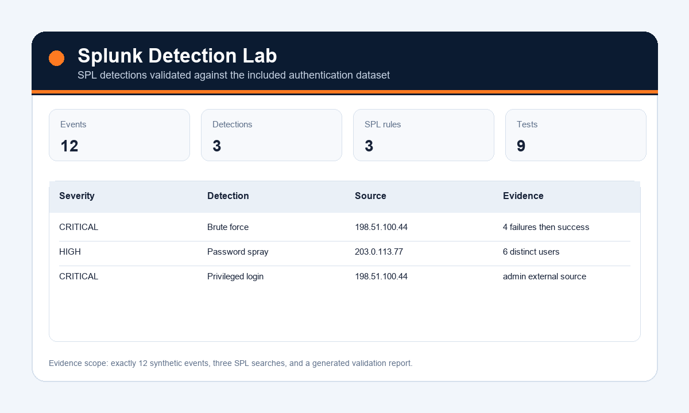

# Splunk Detection Lab


Splunk Detection Lab is a defensive SIEM project that shows how I would build, document, and validate beginner-friendly SOC detections using Splunk SPL.

## Screenshot



## Employer Review

| Area | Evidence |
| --- | --- |
| Target role | SOC Analyst / SIEM Analyst |
| Strongest proof | SPL detections, synthetic authentication logs, analyst playbook, tests |
| Start here | [docs/analyst-playbook.md](docs/analyst-playbook.md) |
| Deeper review | [docs/employer-review.md](docs/employer-review.md) |
| Roadmap | [docs/roadmap.md](docs/roadmap.md) |

The project uses safe synthetic authentication logs and includes:

- SPL searches for common SOC scenarios.
- Sample Windows/Linux-style authentication events.
- Time-windowed Python validation logic that proves the detection ideas work on sample data.
- Unit tests covering positive detections, event ordering, time-window boundaries, and malformed sources.
- Analyst notes covering evidence, false positives, and triage actions.

## Why This Helps Employers

Entry-level SOC roles often ask for SIEM familiarity. This project demonstrates that I understand more than tool names: I can describe what data is needed, write detection logic, validate it, and explain how an analyst should investigate the result.

## Detection Use Cases

| Detection | SOC Value | SPL |
| --- | --- | --- |
| Brute-force login attempts | Finds repeated failures against one account or host | [bruteforce_login.spl](spl/bruteforce_login.spl) |
| Password spraying | Finds one source trying many users | [password_spray.spl](spl/password_spray.spl) |
| Privileged login from unusual source | Flags admin access from unexpected IP ranges | [privileged_unusual_source.spl](spl/privileged_unusual_source.spl) |

## Quick Start

```bash
python -m venv .venv
.venv\Scripts\activate
pip install -e .
python -m splunk_detection_lab.detector
python -m unittest discover -s tests -v
```

## Example Output

```text
BRUTE_FORCE: 198.51.100.44 against admin on web-01
PASSWORD_SPRAY: 203.0.113.77 attempted 6 users
PRIVILEGED_UNUSUAL_SOURCE: admin from 198.51.100.44
```

## Project Structure

| Path | Purpose |
| --- | --- |
| `sample_data/auth_events.json` | Safe synthetic login events |
| `spl/` | Splunk SPL searches |
| `src/splunk_detection_lab/detector.py` | Local validation logic |
| `tests/` | Unit tests for detection behavior |
| `docs/analyst-playbook.md` | Triage notes and false-positive handling |
| `docs/examples/example_detection_report.md` | Reproducible report generated from the included 12 events |

## Evidence Scope

The included dataset contains **12 synthetic authentication events** and validates **three SPL detection use cases**. The preview and example report are based on that exact dataset; no production event counts are claimed.

## Responsible Use

This project is defensive and uses synthetic logs only. It does not perform scanning, credential attacks, exploitation, or interaction with live systems.

